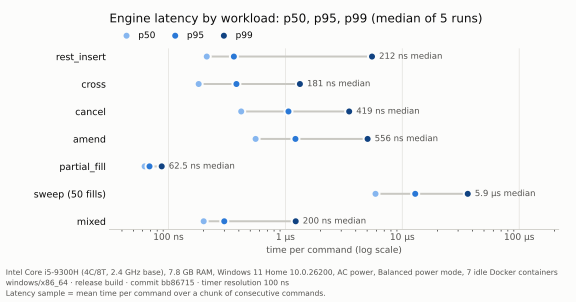
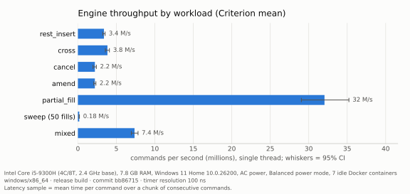

# Benchmarks

Single-threaded cost of the engine's operations on the workloads in
`crates/lob-bench` (see [testing.md](testing.md#benchmarks)). These are
measurements of one laptop in one state, not a performance claim; the
section on variation below matters as much as the numbers.

## Conditions

| | |
|---|---|
| CPU | Intel Core i5-9300H, 4 cores / 8 threads, 2.4 GHz base, 4.1 GHz max turbo |
| Memory | 7.8 GB |
| OS | Windows 11 Home 10.0.26200 |
| Power | mains (battery charging), Windows "Balanced" power mode |
| Measured CPU clock | 85–111% of base (median about 90%, ≈2.2 GHz), sampled every 5 s with the `% Processor Performance` counter during the Criterion run; 84–87% during a harness run. Turbo was essentially not engaged. |
| Background | Docker Desktop with 7 idle containers (<1% CPU each) |
| Toolchain | rustc 1.98.1, `release` profile (`lto = "fat"`, `codegen-units = 1`) |
| Engine code | commit `bb86715` |

## Method

**Workloads.** Each workload is a starting snapshot plus a fixed command
batch generated from a fixed seed. The snapshot is restored outside the
timed region before every batch, so every measurement covers identical work.

**Latency distribution** (`cargo run --release -p lob-bench --bin latency`).
Commands are applied in chunks of 16 consecutive commands (1 for `sweep`),
and each chunk is timed with `Instant`; one sample is the mean time per
command within a chunk. Chunking is needed because the timer resolution on
this machine is 100 ns and one `Instant::now()` costs about 95 ns, both
measured by the harness at start-up. Consequences:

- percentiles describe chunk means, which smooths single-command spikes;
- each sample carries roughly 95 ns / 16 ≈ 6 ns of timer overhead and up to
  one 100 ns tick of quantisation per chunk, so the harness **overstates**
  operations that take well under 100 ns (see `partial_fill` below).

Each run is 3 warm-up rounds plus 50 measured rounds per workload (3,150
samples per 1,000-command workload, 31,250 for `mixed`, 5,000 for `sweep`).
Five independent runs (separate processes) were made; the table reports the
**median across runs** of each percentile and the **range of p50 across
runs**. Raw files: `bench/runs/latency-*.json`.

**Mean and throughput** (`cargo bench -p lob-bench --bench engine`).
Criterion 0.7 with 2 s warm-up, 10 s measurement, 50 samples, timing the
whole batch per iteration. Reported: mean time per command (batch mean ÷
batch size) and its 95% confidence interval. Raw estimates:
`bench/criterion/*.json`.

`bench/summary.json`, the charts and the table below are produced by
`tools/plot_bench.py` from those committed files.

## Results





| Workload | p50 | p50 range across runs | p95 | p99 | Criterion mean | Throughput |
|---|---:|---:|---:|---:|---:|---:|
| `rest_insert` | 212 ns | 206 ns – 212 ns | 362 ns | 5.51 µs | 295 ns | 3.4 M/s |
| `cross` | 181 ns | 175 ns – 181 ns | 381 ns | 1.33 µs | 260 ns | 3.8 M/s |
| `cancel` | 419 ns | 406 ns – 431 ns | 1.06 µs | 3.51 µs | 453 ns | 2.2 M/s |
| `amend` | 556 ns | 531 ns – 556 ns | 1.22 µs | 5.05 µs | 454 ns | 2.2 M/s |
| `partial_fill` | 62.5 ns | 56.2 ns – 62.5 ns | 68.8 ns | 87.5 ns | 31.2 ns | 32 M/s |
| `sweep (50 fills)` | 5.9 µs | 5.7 µs – 6 µs | 12.9 µs | 36.3 µs | 5.67 µs | 0.18 M/s |
| `mixed` | 200 ns | 194 ns – 200 ns | 300 ns | 1.23 µs | 136 ns | 7.4 M/s |

Values are rounded to three significant figures at most.

## Reading the results

- **Relative cost is the robust result.** In both tools a partial fill
  against the head of a queue is the cheapest operation, resting and
  single-fill crossing cost a few hundred nanoseconds, cancel and amend in a
  20,000-order book cost about 1.5–1.7× that, and a 50-fill sweep costs about
  110 ns per fill.
- **Cancel and amend are dominated by memory access, not by the algorithm.**
  An experiment during development cancelled 1,000 orders in books of
  different sizes: best-of-20 cost per cancel was about 120 ns in a
  2,000-order book and about 300 ns in a 20,000-order book (230 ns when the
  targets were evenly strided rather than random). A standalone id-index
  lookup cost about 19 ns. `remove` does no work proportional to queue
  length, so the growth is scattered accesses to the order and its queue
  neighbours in a larger working set.
- **The tails come from rare events.** The long p99s on `rest_insert` and
  `amend` sit well above their p95s; these include one-off costs such as
  growth of the arena and price-level map and operating-system interrupts,
  which chunked sampling cannot separate.
- **`partial_fill` shows the harness's limit.** Its commands take about
  31 ns (Criterion), so a 16-command chunk spans only about five timer ticks;
  the harness's 56–63 ns p50 is mostly timer overhead and quantisation.
  Criterion's figure is the one to use for sub-100 ns operations.

## Variation between runs

On this machine absolute numbers moved by 2–3× between runs taken minutes
apart, depending on whether the CPU was boosting. For example, with the same
build, `cross` measured a 62 ns p50 in one harness run and 175–181 ns in the
five runs above, and Criterion measured 75 ns/command for `cross` in a run
where the CPU clock was not recorded. The published runs were made in one
session in which the clock, sampled during the Criterion run and during an
additional harness run, stayed near base frequency; that is slower but more
repeatable. Faster numbers are achievable on this hardware with turbo
active; they are not reported because the clock state was not controlled.

## Reproducing

```
cargo bench -p lob-bench --bench engine
for i in 1 2 3 4 5; do
  cargo run --release -p lob-bench --bin latency -- --rounds 50 \
    --machine "<describe machine>" --commit "$(git rev-parse --short HEAD)" \
    --out docs/bench/runs/latency-$i.json
done
python tools/plot_bench.py docs/bench/runs target/criterion docs/bench
```

`tools/requirements.txt` lists the Python dependency (matplotlib). Record
the power source, power mode and, if possible, the CPU clock alongside any
published run.
